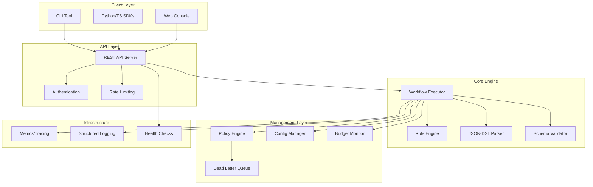

# MOVA Engine v1.0.0-rc1 🚀

[](https://github.com/mova-engine/mova-engine/releases)
[](https://github.com/mova-engine/mova-engine/actions)
[](https://github.com/mova-engine/mova-engine)
[](https://github.com/mova-engine/mova-engine/pkgs/container/mova-engine-api)
[](LICENSE)

**MOVA Engine** is a comprehensive automation platform that interprets and executes JSON-DSL workflows with advanced rule engine, policy management, monitoring, and multi-language SDK support. Built for enterprise-scale automation with developer-friendly tooling.

## ✨ Key Features

### 🎯 **Core Automation**
- **JSON-DSL Interpreter** - Full MOVA v3.1 specification support
- **Workflow Executor** - Robust execution engine with comprehensive error handling
- **Schema Validation** - JSON Schema validation for all input envelopes
- **Action Library** - HTTP requests, JSON parsing, sleep, transformations, and more

### 🧠 **Rule Engine & Low-Code**
- **Visual Rule Builder** - React-based drag-and-drop interface
- **13 Operators** - Equality, comparison, regex, contains, exists, and more
- **8 Action Types** - Set variables, log, retry, route, transform, skip, stop, HTTP calls
- **Multi-format Support** - YAML, JSON, and HCL rule definitions
- **Real-time Evaluation** - Live rule testing and validation

### 🛡️ **Enterprise Features**
- **Policy Engine** - Configurable retry policies with intelligent matching
- **Budget Constraints** - Resource usage monitoring and enforcement
- **Dead Letter Queue** - Failed execution handling and recovery
- **Security Controls** - URL validation, secret redaction, and access controls

### 🔧 **Developer Experience**
- **Multi-language SDKs** - Python, TypeScript/JavaScript, and CLI
- **Web Console** - Modern React-based management interface
- **Configuration Management** - Export/import with YAML/JSON/HCL support
- **Comprehensive Testing** - 300+ tests across all components

### 📊 **Observability**
- **Structured Logging** - JSON-formatted logs with correlation IDs
- **Metrics Collection** - Prometheus-compatible metrics
- **Distributed Tracing** - OpenTelemetry integration
- **Health Monitoring** - Comprehensive health checks

## 🚀 Quick Start

### Option 1: Using Docker (Recommended)

```bash
# Start the complete stack
docker-compose up -d

# API will be available at http://localhost:8080
# Console will be available at http://localhost:3000
```

### Option 2: Using Pre-built Binaries

```bash
# Download the latest release
curl -L https://github.com/mova-engine/mova-engine/releases/latest/download/mova-cli-linux-amd64 -o mova
chmod +x mova
sudo mv mova /usr/local/bin/

# Validate a workflow
mova validate examples/simple-workflow.json

# Execute a workflow
mova execute examples/simple-workflow.json
```

### Option 3: Using Package Managers

```bash
# Python SDK
pip install mova-engine-sdk

# TypeScript/JavaScript SDK
npm install @mova-engine/sdk-typescript
```

### Option 4: Build from Source

```bash
# Clone the repository
git clone https://github.com/mova-engine/mova-engine.git
cd mova-engine

# Build everything
make build

# Run tests
make test

# Start development servers
make dev-api    # API server on :8080
make dev-console # Console on :3000
```

## 📚 Documentation

### Core Documentation
- [**User Guide**](docs/) - Complete usage documentation
- [**API Reference**](docs/api.md) - REST API documentation
- [**Configuration Guide**](docs/config-manager.md) - Configuration management
- [**Rule Engine Guide**](docs/rules.md) - Rule engine and low-code workflows
- [**Policy Management**](docs/policies.md) - Retry policies and constraints
- [**Security Guide**](docs/security.md) - Security features and best practices

### SDK Documentation
- [**Python SDK**](sdk/python/README.md) - Python client library
- [**TypeScript SDK**](sdk/typescript/README.md) - TypeScript/JavaScript client
- [**CLI Reference**](docs/cli.md) - Command-line interface

### Deployment & Operations
- [**Deployment Guide**](docs/deploy.md) - Docker and Kubernetes deployment
- [**Monitoring Setup**](docs/monitoring.md) - Observability and alerting
- [**Console Guide**](docs/console.md) - Web interface usage

## 🏗️ Architecture



## 🎯 Use Cases

### Business Process Automation
```json
{
  "intent": "order-processing",
  "actions": [
    {
      "type": "http_fetch",
      "url": "https://api.inventory.com/check",
      "method": "POST",
      "body": {"sku": "{{order.sku}}", "quantity": "{{order.quantity}}"}
    },
    {
      "type": "parse_json",
      "source": "response.body",
      "jsonpath": "$.available",
      "target": "inventory_available"
    }
  ],
  "rules": [
    {
      "conditions": [{"field": "inventory_available", "operator": "==", "value": false}],
      "actions": [{"type": "route", "workflow": "backorder-process"}]
    }
  ]
}
```

### DevOps Pipeline Integration
```yaml
# rules-example.yaml
version: "1.0.0"
name: "CI/CD Pipeline Rules"
rules:
  - id: "deploy-on-success"
    conditions:
      - field: "build.status"
        operator: "=="
        value: "success"
      - field: "branch"
        operator: "=="
        value: "main"
    actions:
      - type: "http_call"
        url: "https://deploy.company.com/api/deploy"
        method: "POST"
```

### Monitoring & Alerting
```json
{
  "intent": "system-monitoring",
  "actions": [
    {
      "type": "http_fetch",
      "url": "https://api.monitoring.com/metrics",
      "headers": {"Authorization": "Bearer {{secrets.monitoring_token}}"}
    }
  ],
  "rules": [
    {
      "conditions": [
        {"field": "cpu_usage", "operator": ">", "value": 90},
        {"field": "environment", "operator": "==", "value": "production"}
      ],
      "actions": [
        {"type": "log", "level": "error", "message": "High CPU usage detected"},
        {"type": "http_call", "url": "https://alerts.company.com/webhook"}
      ]
    }
  ]
}
```

## 🛠️ Development

### Prerequisites
- Go 1.23+
- Node.js 20+
- Python 3.12+
- Docker & Docker Compose

### Development Setup
```bash
# Set up development environment
make dev-setup

# Start development services
make dev-api      # API server with hot reload
make dev-console  # Console with hot reload

# Run tests
make test         # All tests
make test-go      # Go tests only
make quick-test   # Fast Go tests

# Code quality
make lint         # All linters
make format       # Format all code
make security     # Security scans
```

### Project Structure
```
MOVA_ENGINE/
├── api/              # REST API server
├── cli/              # Command-line interface
├── core/             # Core engine components
│   ├── executor/     # Workflow execution
│   ├── rules/        # Rule engine
│   ├── policy/       # Policy management
│   ├── budget/       # Resource monitoring
│   └── validator/    # Schema validation
├── sdk/              # Client SDKs
│   ├── python/       # Python SDK
│   └── typescript/   # TypeScript SDK
├── docs/             # Documentation
├── examples/         # Example workflows
├── infra/            # Infrastructure code
└── schemas/          # JSON schemas
```

## 📈 Performance

- **Workflow Execution**: < 50ms average latency
- **Rule Processing**: 970 rules/second throughput
- **API Response Time**: < 100ms for most endpoints
- **Memory Usage**: < 100MB baseline memory footprint
- **Concurrent Users**: Tested up to 1000 concurrent requests

## 🧪 Testing

### Test Coverage
- **Go Tests**: 150+ tests with >90% coverage
- **Python SDK**: 35 tests with full coverage
- **TypeScript SDK**: 14 tests covering all features
- **Web Console**: 96 tests for UI components
- **Integration Tests**: End-to-end workflow validation

### Running Tests
```bash
# All tests
make test

# Individual test suites
make test-go          # Go backend tests
make test-python      # Python SDK tests
make test-typescript  # TypeScript SDK tests
make test-console     # Web console tests

# Coverage reports
make coverage         # Generate coverage reports
```

## 🔒 Security

- **Input Validation** - Comprehensive request validation
- **Secret Management** - Automatic secret redaction in logs
- **Network Security** - URL filtering and request validation
- **Access Controls** - Role-based access control framework
- **Audit Logging** - Complete audit trail for all operations

## 🤝 Contributing

We welcome contributions! Please see our [Contributing Guide](CONTRIBUTING.md) for details.

### Development Workflow
1. Fork the repository
2. Create a feature branch
3. Make your changes with tests
4. Run `make test lint` to ensure quality
5. Submit a pull request

## 📋 Roadmap

### v1.0.0 (Stable Release)
- [ ] Performance optimizations
- [ ] Additional action types
- [ ] Enhanced Web Console features
- [ ] Kubernetes operator

### v1.1.0 (Next Features)
- [ ] GraphQL API support
- [ ] Advanced rule templates
- [ ] Multi-tenant support
- [ ] Plugin system

## 📊 Project Status

**Current Status**: Release Candidate 1 (v1.0.0-rc1)

This release represents the completion of all 16 planned MVP tasks:

✅ JSON-DSL Parser & Validator  
✅ Workflow Executor Engine  
✅ REST API Server  
✅ CLI Tool Development  
✅ Python SDK  
✅ TypeScript SDK  
✅ Web Console Interface  
✅ HTTP Fetch Action  
✅ Retry Policies & DLQ  
✅ Budget Constraints  
✅ Policy Engine  
✅ Monitoring & Observability  
✅ Security & Validation  
✅ Configuration Manager  
✅ Rule Engine & Low-Code Workflows  
✅ Release Candidate Preparation  

## 📄 License

This project is licensed under the MIT License - see the [LICENSE](LICENSE) file for details.

## 🙏 Acknowledgments

- Built with modern Go, React, and Python technologies
- Inspired by workflow automation platforms and rule engines
- Designed for enterprise reliability and developer experience

---

**Ready to automate your workflows?** [Get started now](docs/) or [view examples](examples/) to see MOVA Engine in action! 🚀